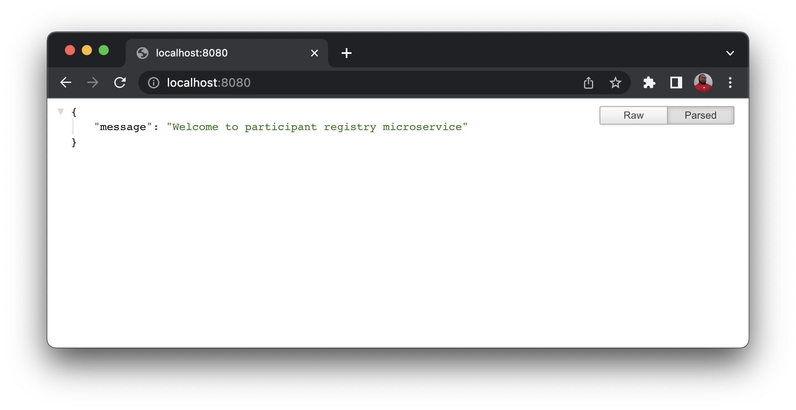
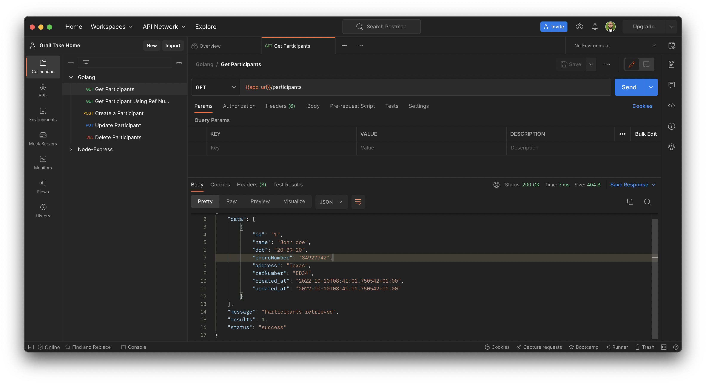
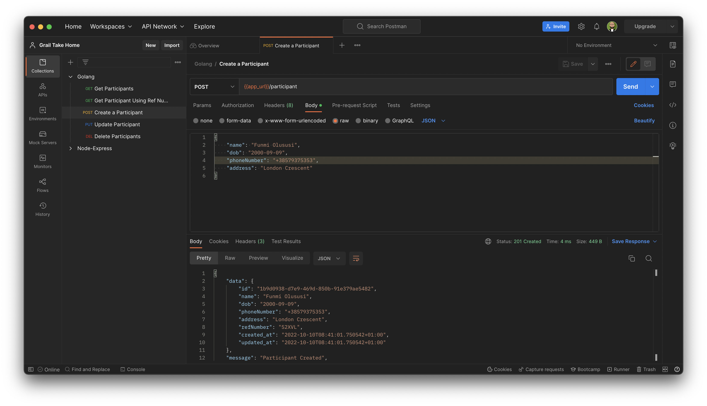
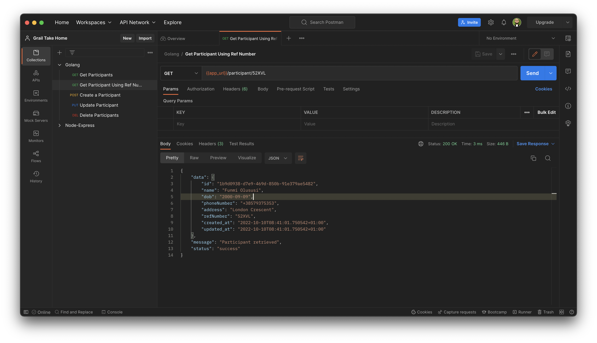
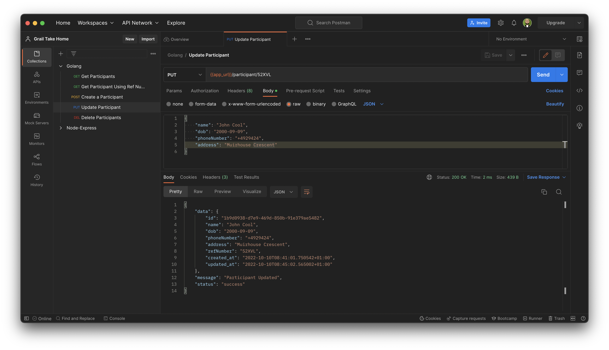
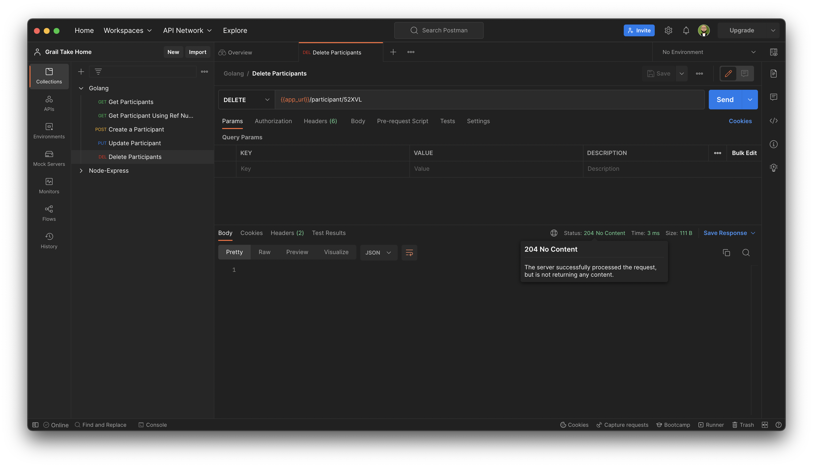

# Participant Registry Microservice

[](https://circleci.com/gh/yemiwebby/participants-registry)

## Prerequisite

This project requires [Go](https://go.dev/) runtime installed on your computer. Follow the instructions [here to download](https://go.dev/doc/install) and install it for your computer's operatiing system.

## Clone the project

```bash
git clone https://github.com/yemiwebby/participants-registry.git
```

Navigate into the project

```bash
cd participants-registry
```

## Run the application

```bash
make server
```

Alternatively, you can also run the project using:

```bash
go run main.go
```

The preceding command will automatically start the project on [http://localhost:8080](http://localhost:8080)



**Note**: If you encouter an error about `gotest`, run the command below to install fix it:

```bash
go install github.com/rakyll/gotest
```

## Run test

Issue the following command from the root of the application to run unit test:

```bash
make test
```

Alternatively, you can also use the following command:

```bash
gotest -v -cover ./api
```

Or

```bash
go test -v -cover ./api
```

## Test the application

Use API testing tools such as [Postman](https://www.postman.com/) or [Insomnia](https://insomnia.rest/) to test the application locally.

### Get the list of participants



### Create a participant



### Get participant



### Update participant



### Delete participant


